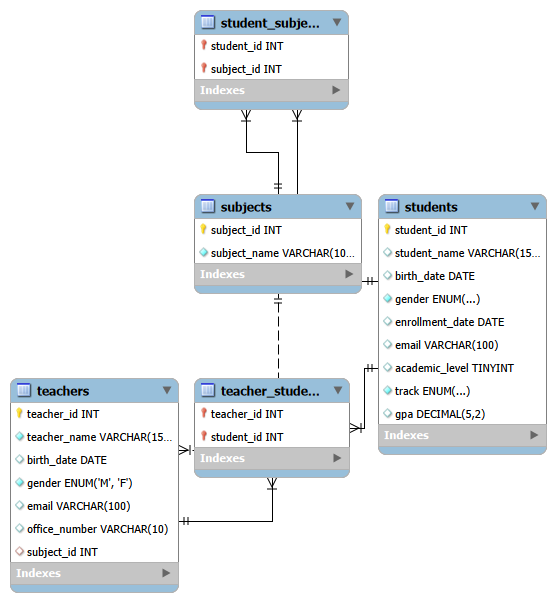
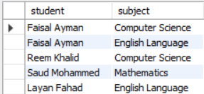
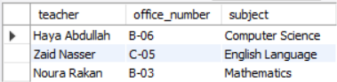
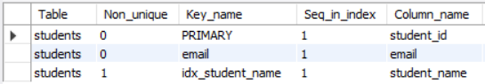

# Elite Academy SQL Project Series
This repository presents a structured SQL project series for the **Elite Academy** management system. It demonstrates database design, data processing, and advanced querying techniques for managing academic records. ✨

## Current Focus
* **Database Structure:** Implementation of the core tables for `subjects`, `teachers`, and `students`.
* **Data Management:** Populated the system with realistic records to simulate a functional environment.
* **Advanced SQL Processing:** Data cleaning, transformations, and analytical queries.
* **Relational Modeling:** Implementation of table relationships, stored procedures, views, and indexing.

## Project Files
* `elite_academy_v1_foundation.sql`: Core database schema and initial data.
* `elite_academy_v2_data_processing.sql`: Data cleaning, transformation, and analytical queries implementation.
* `elite_academy_v3_relationships.sql`: Relationships, stored procedures, views, and indexing implementation.

## Tools
* **MySQL Workbench** – Used for designing and executing the database system.

## Database Schema
The following diagram illustrates the relationships between the main tables in the Elite Academy database.

## Version 1 – Database Foundation

### Database Architecture
The foundational structure of the Elite Academy system showing the core tables.

### Execution Logs
A detailed view of successful SQL operations.

### Data Sample
A preview of student records stored in the database.

---

## Version 2 – Data Processing & Analysis

### High-Performing Students Segment
Students with GPA greater than 90, stored in a dedicated table for performance analysis.

### At-Risk Students Segment
Students with GPA less than 60, identified for targeted academic improvement.

### GPA Statistics Overview
Summary statistics including the average, minimum, and maximum GPA values across all students.

---

## Version 3 – Relationships & Advanced SQL

### Student Information Procedure
A stored procedure (student_info) that retrieves student names along with the subjects they study by joining multiple tables.

### Teacher Information View
A database view (teacher_info) displaying teacher names, office numbers, and the subjects they teach.

### Student Name Index
An index created on the students table to improve the performance of searching and sorting student names.

